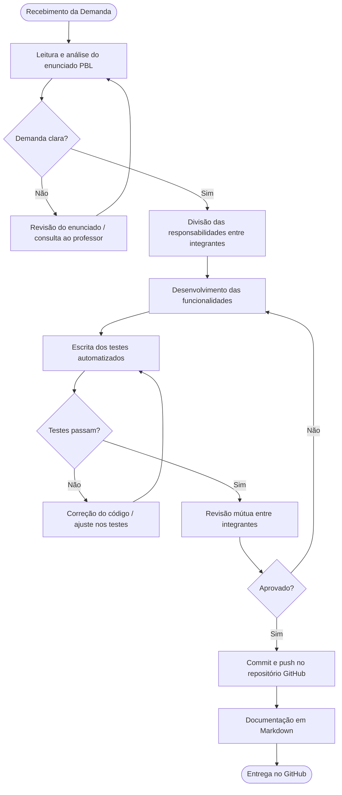

# PBL9 – Qualidade de Processo

> Centro Universitário Senac-RS
> ADS – Análise e Desenvolvimento de Sistemas / SPI – Sistemas para Internet
> Unidade Curricular: Qualidade de Software | Prof.: Luciano Zanuz
> Aula 14

## 👥 Integrantes

- Silvio Eduardo Cezarino de Castilhos
- Murilo da Silva Noguêz

---

## 🔹 1. Mapeamento do Processo Atual

O diagrama abaixo representa o fluxo de desenvolvimento e validação adotado pela equipe para as entregas do projeto LocalEats:

---

## 🔹 2. Identificação de Entradas, Atividades e Saídas

| Etapa | Entrada | Atividade | Saída |
|---|---|---|---|
| **Recebimento da Demanda** | Enunciado do PBL (PDF/Docs) | Leitura, análise e levantamento de dúvidas | Compreensão do escopo da entrega |
| **Planejamento** | Escopo definido | Divisão de tarefas entre os integrantes; definição de quem cobre cada funcionalidade | Lista de responsabilidades por membro |
| **Desenvolvimento** | Requisitos e código existente do LocalEats | Implementação das funcionalidades ou scripts de teste pedidos | Código Python / Gherkin / Playwright funcional |
| **Testes** | Código desenvolvido | Execução dos testes automatizados (pytest, pytest-bdd, Playwright) | Relatório de execução; evidência de testes passando |
| **Correção de Defeitos** | Falhas identificadas nos testes | Análise da causa raiz, ajuste no código ou nos steps | Código corrigido com testes passando novamente |
| **Revisão** | Código e testes prontos | Revisão cruzada entre os integrantes; leitura do arquivo Markdown | Código validado; eventuais ajustes antes do commit |
| **Entrega** | Artefatos revisados | Commit, push no GitHub e organização da estrutura de pastas | Repositório atualizado com documentação e código |

---

## 🔹 3. Reflexão sobre o Processo

### O processo utilizado pela equipe está claramente definido?

Parcialmente. A equipe possui uma rotina implícita — leitura do enunciado, divisão de tarefas, desenvolvimento, testes e entrega — mas ela não está formalizada em nenhum documento. O processo funciona porque os dois integrantes já o internalizaram, mas um novo membro teria dificuldade em entrar no ritmo sem orientação explícita.

### Todos os integrantes seguem o mesmo fluxo de trabalho?

Sim, de forma geral. Cada integrante cobre uma funcionalidade diferente dentro do mesmo PBL, mas ambos seguem as mesmas etapas: analisar o escopo, desenvolver, testar e documentar. A diferença está nos detalhes de implementação de cada funcionalidade individual.

### Em quais etapas a qualidade é verificada?

A qualidade é verificada em três momentos principais:
1. **Durante o desenvolvimento** — ao escrever testes unitários ou BDD antes ou junto com o código (prática próxima ao TDD).
2. **Na execução dos testes** — `pytest` ou `pytest-bdd` sinaliza falhas que precisam ser corrigidas antes da entrega.
3. **Na revisão mútua** — um integrante revisa o trabalho do outro antes do commit, identificando inconsistências na lógica ou na documentação.

### Quais melhorias poderiam tornar o processo mais eficiente?

- **Formalizar o fluxo** em um CONTRIBUTING.md ou checklist de entrega no repositório.
- **Adotar um quadro Kanban** (GitHub Projects) para acompanhar o status de cada tarefa dentro do PBL.
- **Definir critérios de aceite antes do desenvolvimento** (DoR/DoD), evitando retrabalho por interpretações divergentes do enunciado.
- **Automatizar a execução dos testes via CI** (GitHub Actions), para que qualquer push no repositório acione o pipeline e produza evidência automática da qualidade.
- **Registrar defeitos formalmente** com Issues no GitHub, criando rastreabilidade entre o problema identificado e a correção aplicada.

### Como a qualidade do processo impacta a qualidade do produto final?

Diretamente. Nas entregas em que a equipe seguiu um processo mais estruturado — como no PBL8, onde os cenários BDD foram escritos antes do código de automação — os testes ficaram mais coesos e os defeitos foram detectados mais cedo. Já em entregas com processo menos definido, houve retrabalho: testes escritos depois do código encontravam comportamentos que não correspondiam ao esperado, obrigando ajustes que poderiam ter sido evitados. Um processo claro reduz ambiguidade, diminui retrabalho e aumenta a confiança na entrega.
